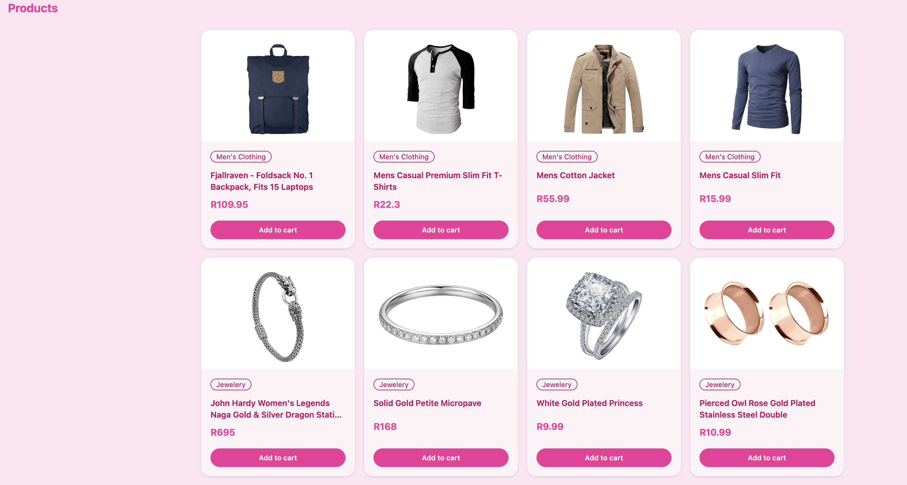
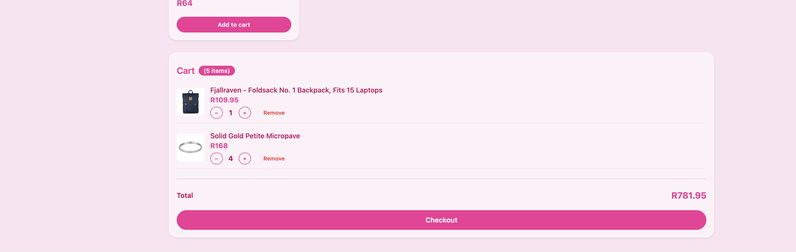

# Shopping Cart

A shopping cart app built with React, TypeScript, Reducer + Context. No prop drilling. Built as a learning project to understand state management patterns in React.

---

## Tech Stack

- **React 19** — UI library
- **TypeScript** — type safety, no `any`
- **Vite** — build tool
- **DaisyUI + Tailwind CSS** — styling, cupcake theme
- **vite-plugin-pwa** — service worker + PWA manifest
- **FakeStore API** — product data

---

## Preview


---


## Features

- Browse 9 products fetched from FakeStore API
- Add items to cart
- Remove items from cart
- Increase / decrease quantity per item
- Cart summary with total items and total price
- Responsive — mobile first (2 cols → 4 cols)
- PWA — installable, works offline

---

## Project Structure

```
src/
├── App.tsx                       # Nearly empty — just layout + CartProvider
├── context/
│   └── CartContext.tsx           # createContext, CartProvider, useCart, useCartDispatch
├── reducer/
│   └── cartReducer.ts            # cartReducer — all cart state logic
├── types/
│   └── index.ts                  # Product, CartItem, CartState, Action types
├── data/
│   └── productsPromise.ts        # fetchProduct + Promise.all
└── components/
    ├── ProductGrid.tsx            # Renders product grid using use()
    ├── ProductCard.tsx            # Single product card, dispatches ADD_ITEM
    └── CartSummary.tsx            # Cart items, quantity controls, total, checkout
```

---

## State Management

All cart state lives in a `useReducer`. No standalone `useState` for cart data.

### The Reducer handles 4 actions:

| Action | What it does |
|---|---|
| `ADD_ITEM` | Adds product or increases quantity if already in cart |
| `DECREASE_ITEM` | Decreases quantity by 1, removes item if quantity reaches 0 |
| `REMOVE_ITEM` | Removes item completely |
| `UPDATE_QUANTITY` | Sets an exact quantity |

### Context eliminates prop drilling:

Two contexts are used — one for state, one for dispatch:

```
CartProvider (owns state + dispatch)
  ├── ProductCard   → useCartDispatch() to fire ADD_ITEM
  ├── CartSummary   → useCart() to read items + useCartDispatch() for controls
  └── App           → knows nothing about cart state
```

### Custom hooks:

- `useCart()` — read cart state anywhere
- `useCartDispatch()` — fire actions anywhere

---

## Data Fetching

No `useEffect`. Products are fetched using `Promise.all` at module level and unwrapped with React 19's `use()` hook inside `ProductGrid`. A `<Suspense>` boundary shows a loading state while the fetch resolves.

```ts
const fetchProduct = async (id: number): Promise<Product> => {
  const response = await fetch(`https://fakestoreapi.com/products/${id}`);
  return response.json();
};

const productsPromise: Promise<Product[]> = Promise.all(
  Array.from({ length: 9 }, (_, index) => fetchProduct(index + 1))
);
```

---

## Getting Started

```bash
# Install dependencies
npm install

# Run development server
npm run dev

# Build for production
npm run build

# Preview production build (use this for Lighthouse)
npm run preview
```

---

## Lighthouse Scores

Tested on production build (`npm run preview`):

| Category | Mobile | Desktop |
|---|---|---|
| Performance | 75 | 90 |

---

## Styling Approach

Inline styles were used during early development intentionally — keeping focus on getting the logic (reducer, context, fetch) working correctly before adding styling. Practising Mentor's advice for development: get it working, then make it look good.

DaisyUI's `valentine` theme was applied in the final sprint using Tailwind utility classes throughout.

---

